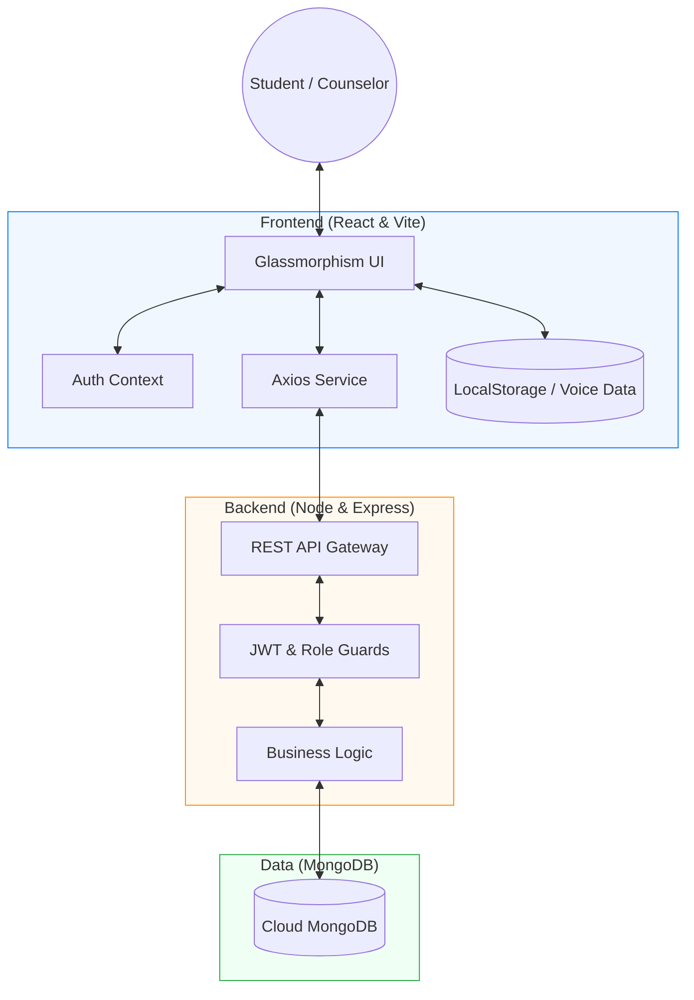

<<<<<<< HEAD
# React + Vite

This template provides a minimal setup to get React working in Vite with HMR and some ESLint rules.

Currently, two official plugins are available:

- [@vitejs/plugin-react](https://github.com/vitejs/vite-plugin-react/blob/main/packages/plugin-react) uses [Oxc](https://oxc.rs)
- [@vitejs/plugin-react-swc](https://github.com/vitejs/vite-plugin-react/blob/main/packages/plugin-react-swc) uses [SWC](https://swc.rs/)

## React Compiler

The React Compiler is not enabled on this template because of its impact on dev & build performances. To add it, see [this documentation](https://react.dev/learn/react-compiler/installation).

## Expanding the ESLint configuration

If you are developing a production application, we recommend using TypeScript with type-aware lint rules enabled. Check out the [TS template](https://github.com/vitejs/vite/tree/main/packages/create-vite/template-react-ts) for information on how to integrate TypeScript and [`typescript-eslint`](https://typescript-eslint.io) in your project.
=======
# MindCare - Mental Health Support System for Students 🧠🌿

[](https://opensource.org/licenses/MIT)
[](https://reactjs.org/)
[](https://nodejs.org/)

## 📌 Project Title
**Mental Health Support System for Students**

## 📝 Problem Description
Mental health issues among students are increasing rapidly due to academic pressure, personal problems, social anxiety, depression, stress, and other emotional challenges. Many students hesitate to seek help because of fear, stigma, lack of privacy, or limited access to counselors.

Traditional counseling systems are often inefficient and difficult to access quickly. Students may feel uncomfortable discussing their issues openly or may not know how to contact professional support services. As a result, many students suffer silently without receiving proper mental health assistance.

## 💡 Proposed Solution
The **MindCare MERN Mental Health Support System** is a web-based platform developed to provide students with a secure, simple, and private way to request counseling support. 

The platform allows:
- **Students** to submit mental health support requests privately and access self-care tools.
- **Counselors** to manage and respond to requests efficiently through a dedicated dashboard.
- **Organized Storage** of counseling records using MongoDB.
- **Efficient Communication** bridge between students and professionals.

Developed using the **MERN Stack** (MongoDB, Express.js, React.js, Node.js), this solution improves accessibility, privacy, and management of mental health support services.

---

## 🏗️ System Architecture

MindCare follows a modern **MVC (Model-View-Controller)** architecture to ensure separation of concerns and maintainability.



---

## ✨ Features

### 👤 Student Features
- **Secure Authentication**: Private registration and login for students.
- **Submit Support Requests**: Private submission of mental health support requests with detailed issue descriptions.
- **Real-time Status Tracking**: View whether a request is *Pending*, *In Progress*, or *Resolved*.
- **Mood Tracker**: Log daily emotions and visualize emotional trends over time.
- **Daily Journal (Text & Voice) 🎤**: A private space for reflections, supporting both text entries and browser-based voice recordings.
- **Academic Stress Manager**: Track assignments and deadlines with automatic **48-hour urgency alerts**.
- **Calm Corner**: Interactive 4-4-4-4 Box Breathing mindfulness tool.
- **Emergency SOS Help 🚨**: Manage and call trusted contacts instantly during crises.

### 👨‍⚕️ Counselor Features
- **Professional Dashboard**: A centralized overview of all incoming student requests.
- **Request Lifecycle Management**: Efficiently track, assign, and update request statuses.
- **Student Directory**: View a list of all registered students and their basic profiles.
- **Specialization Management**: Display counselor expertise (e.g., Stress, Anxiety, Career) to students.

### ⚙️ System Features
- **RESTful API**: Full implementation of standard API endpoints for seamless data flow.
- **CRUD Operations**: Complete Create, Read, Update, and Delete functionality for all core modules.
- **Glassmorphism UI**: A premium, translucent design system built with Vanilla CSS for a calming user experience.
- **JWT & Role Guards**: Secure, role-based access control (RBAC) to protect sensitive data.

---

## 🛠️ Technologies Used

| Component | Technologies |
|---|---|
| **Frontend** | React 19, Vite, Axios, HTML5, Vanilla CSS3 (Glassmorphism) |
| **Backend** | Node.js, Express.js |
| **Database** | MongoDB, Mongoose |
| **Security** | JWT (JSON Web Tokens), Bcrypt.js |
| **Tools** | VS Code, Postman, GitHub, Mermaid.js |

---

## 🗂️ Project Structure

```text
Mental_Health_Support_Sytem/
├── Backend/
│   ├── config/
│   │   └── db.js                 # Database connection logic
│   ├── controllers/
│   │   ├── authController.js      # User authentication logic
│   │   ├── counselorController.js # Counselor-related logic
│   │   ├── requestController.js   # Support request handling
│   │   └── userController.js      # General user management
│   ├── models/
│   │   ├── counselorModel.js      # Mongoose schema for Counselors
│   │   ├── requestModel.js        # Mongoose schema for Requests
│   │   └── userModel.js           # Mongoose schema for Users
│   ├── routes/
│   │   ├── authRoutes.js          # Authentication endpoints
│   │   ├── counselorRoutes.js     # Counselor endpoints
│   │   ├── requestRoutes.js       # Request endpoints
│   │   └── userRoutes.js          # User endpoints
│   ├── middleware/
│   │   ├── authMiddleware.js      # JWT verification
│   │   └── roleMiddleware.js      # Role-based access control
│   ├── utils/
│   │   └── generateToken.js       # JWT generation utility
│   ├── screenshots/               # API & Database validation
│   │   ├── mongodb/               # MongoDB collection proofs
│   │   ├── requests/              # Request API testing proofs
│   │   └── users/                 # User API testing proofs
│   ├── index.js                   # Server entry point
│   ├── .env                       # Environment variables
│   └── package.json               # Backend dependencies
├── Frontend/
│   ├── src/
│   │   ├── api/
│   │   │   ├── axiosInstance.js   # Axios configuration
│   │   │   ├── authApi.js         # Auth API calls
│   │   │   ├── counselorApi.js    # Counselor API calls
│   │   │   └── requestApi.js      # Request API calls
│   │   ├── components/
│   │   │   ├── Navbar.jsx         # Navigation component
│   │   │   ├── Loader.jsx         # Loading spinner
│   │   │   └── RequestCard.jsx    # Support request card
│   │   ├── context/
│   │   │   └── AuthContext.jsx    # Global authentication state
│   │   ├── pages/
│   │   │   ├── LandingPage.jsx    # Project landing page
│   │   │   ├── LoginPage.jsx      # User login
│   │   │   ├── RegisterPage.jsx   # User registration
│   │   │   ├── StudentDashboard.jsx # Dashboard for students
│   │   │   ├── CounselorDashboard.jsx # Dashboard for counselors
│   │   │   ├── AcademicManager.jsx # Assignment & Deadline tracking
│   │   │   ├── MoodTracker.jsx     # Emotional data visualization
│   │   │   ├── DailyJournal.jsx    # Private text & voice journaling
│   │   │   ├── ProfilePage.jsx    # User profile management
│   │   │   ├── MindfulnessTimer.jsx # Breathing tool
│   │   │   ├── SelfTherapyPage.jsx # Resources page
│   │   │   ├── CounselorsListPage.jsx # List of professionals
│   │   │   └── UsersListPage.jsx  # Admin user list
│   │   ├── routes/
│   │   │   └── ProtectedRoute.jsx # Route guards
│   │   ├── App.jsx                # Main application logic
│   │   ├── main.jsx               # React entry point
│   │   └── index.css              # Global styles & design system
│   ├── package.json               # Frontend dependencies
│   └── vite.config.js             # Vite configuration
└── README.md                      # Project documentation
```

---

## 🧠 Database Collections

### 1. Users Collection
Stores credentials and profiles for both students and counselors.
- **Fields**: `name`, `email`, `password`, `role`, `createdAt`.

### 2. Counselors Collection
Stores professional information and specializations for counselors.
- **Fields**: `name`, `email`, `specialization`, `bio`.

### 3. Requests Collection
Tracks the lifecycle of support requests submitted by students.
- **Fields**: `userId` (Student), `counselorId`, `issue`, `status` (Pending/In-Progress/Resolved).

---

## 🔗 API Endpoints & Security

### 🔐 Authentication Mechanism
MindCare uses **JSON Web Tokens (JWT)** for stateless authentication. 
- Upon successful login, the server issues a signed token containing the user's ID and Role.
- This token is stored in the frontend and must be included in the `Authorization` header for all protected requests.
- **Header Format**: `Authorization: Bearer <JWT_TOKEN>`

### 👤 Authentication & User Management
- **`POST /api/auth/register-user`**  
  Creates a new student account. Passwords are automatically hashed using **Bcrypt.js** (10 salt rounds) before storage. (Public)
- **`POST /api/auth/register-counselor`**  
  Registers a professional counselor profile. Requires specialization and bio fields. (Public)
- **`POST /api/auth/login`**  
  Validates credentials and returns a JWT token along with the user's name, email, and role. (Public)
- **`GET /api/users`**  
  Retrieves a comprehensive list of all registered users. Access is restricted to ensure student privacy. (**Auth: Counselor Only**)

### 👨‍⚕️ Counselor Directory
- **`GET /api/counselors`**  
  Returns a list of all active counselors, including their specializations and availability status. (**Auth: Student/Counselor**)

### 📝 Support Request Management
- **`POST /api/requests`**  
  Allows students to submit a support request. The system automatically links the request to the authenticated student's ID. (**Auth: Student Only**)
- **`GET /api/requests`**  
  Fetches requests. Students see only their own requests; Counselors see all incoming requests. (**Auth: Student/Counselor**)
- **`PUT /api/requests/:id`**  
  Updates the `status` of a specific request. Used by counselors to mark progress from *Pending* to *Resolved*. (**Auth: Counselor Only**)
- **`DELETE /api/requests/:id`**  
  Permanently removes a request from the database. (**Auth: Counselor Only**)

---

## ⚙️ Setup & Installation Instructions

### 1. Environment Prerequisites
Ensure you have the following installed on your local machine:
- **Node.js**: Version 18.x or 20.x (Recommended).
- **MongoDB**: A local MongoDB instance or a **MongoDB Atlas** Cloud account.
- **Git**: For repository cloning and version control.

### 2. Repository Setup
Clone the project to your local workspace:
```bash
git clone https://github.com/HarshiSRanasingha/Mental-Health-Support-System.git
cd Mental-Health-Support-System
```

### 3. Backend Configuration
Navigate to the server directory and install core dependencies including `express`, `mongoose`, `jsonwebtoken`, and `dotenv`:
```bash
cd Backend
npm install
```
Create a `.env` file in the `Backend/` root and configure your secrets:
```env
PORT=5000
MONGO_URI=mongodb+srv://<user>:<password>@cluster.mongodb.net/MindCare
JWT_SECRET=your_long_random_string_here
```

### 4. Frontend Configuration
Open a new terminal, navigate to the frontend directory, and install the React ecosystem:
```bash
cd Frontend
npm install
```

---

## ▶️ Execution Guide

To run the full-stack application, you need to start both the server and the client development environments.

1. **Start the API Server:**
   ```bash
   cd Backend
   npm start
   ```
   *The server will initialize on `http://localhost:5000` and connect to MongoDB.*

2. **Start the React Client:**
   ```bash
   cd Frontend
   npm run dev
   ```
   *Vite will launch the frontend on `http://localhost:5173`.*

---

## 🧪 API Testing & Database Validation

To ensure the reliability and security of the system, rigorous testing was performed:

- **Postman Validation**: Every REST endpoint was validated for correct status codes (`200 OK`, `201 Created`, `401 Unauthorized`) and JSON response structures.
- **Database Proofs**: The `Backend/screenshots/mongodb/` directory contains visual evidence of the Mongoose schemas and successful data persistence.
- **API Response Proofs**: Screenshots in `Backend/screenshots/requests/` and `Backend/screenshots/users/` demonstrate successful CRUD operations and role-based access denials.

---

## 🚀 Future Roadmap & Enhancements

MindCare is designed to be extensible. Our future development phases include:

- **Real-time Crisis Chat**: Implementing **Socket.io** to enable instant, live messaging between students in distress and available counselors.
- **AI-Powered Sentiment Analysis**: Integrating a machine learning model to analyze the emotional tone of journal entries and support requests, flagging high-risk cases for immediate counselor intervention.
- **Appointment Scheduling**: A built-in calendar system allowing students to book virtual or in-person sessions with specific counselors based on their availability.
- **Community Support Boards**: Anonymous, moderated forums where students can share experiences and peer support in a safe environment.
- **Mobile Ecosystem**: Porting the platform to **React Native** to provide native iOS and Android experiences with push notifications for wellness reminders.

---

## ❤️ Conclusion
The **MindCare** Mental Health Support System serves as a vital digital bridge in the student community, removing barriers to professional help through technology. By combining a secure **MERN stack** backend with a modern, calming **Glassmorphism** frontend, it provides a holistic ecosystem that prioritizes both professional intervention and personal self-care. This project stands as a testament to how empathetic software design can address critical mental health challenges in educational institutions.

---

## 👩‍💻 Developed By
**Harshani Sandunika Ranasingha**  
Student ID: 2022/ICT/78  
*Empowering Student Wellbeing through Technology.* 🌿
>>>>>>> a62e4cc95baa930dd2064e5b3f2697949e535109
